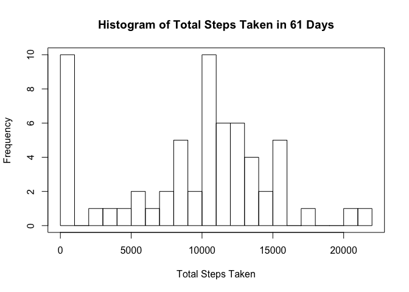
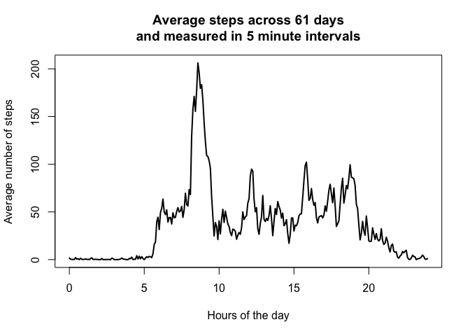
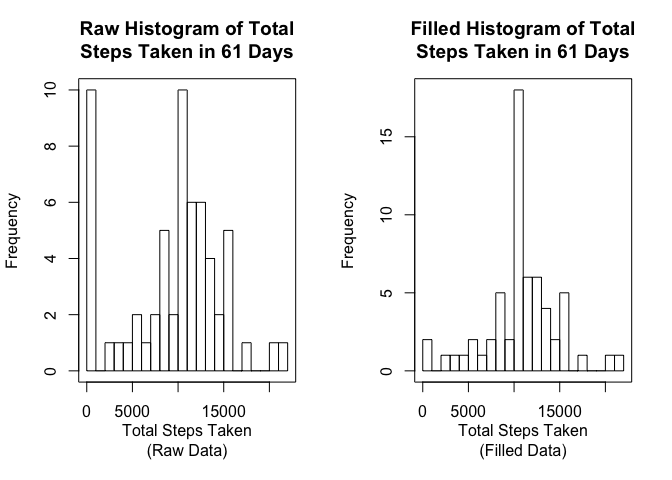
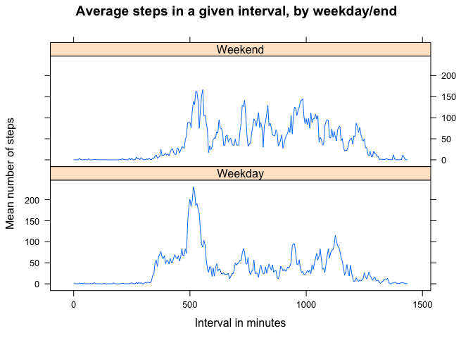

## Setup

```r
knitr::opts_chunk$set(echo = TRUE)
library(dplyr)
```

```
## 
## Attaching package: 'dplyr'
```

```
## The following objects are masked from 'package:stats':
## 
##     filter, lag
```

```
## The following objects are masked from 'package:base':
## 
##     intersect, setdiff, setequal, union
```

```r
library(tidyr)
library(lubridate)
```

```
## 
## Attaching package: 'lubridate'
```

```
## The following object is masked from 'package:base':
## 
##     date
```

```r
library(lattice)
```

## Loading and preprocessing the data

```r
setwd("~/Documents/Classes/DataSciCourse/RepData_PeerAssessment1")
data <- read.csv(unz('activity.zip', "activity.csv"), colClasses = c("numeric", 
                                                "character", "character"))
data <- as_tibble(data)
data
```

```
## # A tibble: 17,568 x 3
##    steps date       interval
##    <dbl> <chr>      <chr>   
##  1    NA 2012-10-01 0       
##  2    NA 2012-10-01 5       
##  3    NA 2012-10-01 10      
##  4    NA 2012-10-01 15      
##  5    NA 2012-10-01 20      
##  6    NA 2012-10-01 25      
##  7    NA 2012-10-01 30      
##  8    NA 2012-10-01 35      
##  9    NA 2012-10-01 40      
## 10    NA 2012-10-01 45      
## # ... with 17,558 more rows
```

Date was imported as a character. Let's fix that and the intervals. The intervals 
are in the following base 60 format: HHMM where H is an hour digit and M is a 
minute digit. This makes a linear plot of the interval data skip large sections 
of base 10 space. Here are the date conversions:

```r
# This 'for' loop converts the intervals to raw minutes
data <- data %>% mutate(Minutes = NA)
for(i in 1:dim(data)[1]) {
        if(nchar(data[i, 3]) <= 2){
                data$Minutes[i] = as.numeric(data[i, 3])
        } else if(nchar(data[i, 3]) == 3){
                data$Minutes[i] = 60*as.numeric(substr(data[i, 3], 1, 1)) + 
                                   as.numeric(substr(data[i, 3], 2, 3))
        } else if(nchar(data[i, 3]) == 4){
                data$Minutes[i] = 60*as.numeric(substr(data[i, 3], 1, 2)) + 
                                   as.numeric(substr(data[i, 3], 3, 4))
        }
}

# This 'for' loop will reformat the intervals to be "HH:MM". Some of the 
#       intervals have only one, two, or three digits and this must be taken
#       into account with the 'if' statements.
for(i in 1:dim(data)[1]) {
        if(nchar(data[i, 3]) == 1){
                data[i, 3] = paste("00:0", data[i, 3], sep = "")
        } else if(nchar(data[i, 3]) == 2){
                data[i, 3] = paste("00:", data[i, 3], sep = "")
        } else if(nchar(data[i, 3]) == 3){
                data[i, 3] = paste("0", substr(data[i, 3], 1, 1), ":", 
                                   substr(data[i, 3], 2, 3), sep = "")
        } else if(nchar(data[i, 3]) == 4){
                data[i, 3] = paste(substr(data[i, 3], 1, 2), ":", 
                                   substr(data[i, 3], 3, 4), sep = "")
        }
}

data <- data %>% mutate(date_time = as.POSIXct(paste(date, interval), 
                       format = "%Y-%m-%d %H:%M"), date = ymd(date))

data
```

```
## # A tibble: 17,568 x 5
##    steps date       interval Minutes date_time          
##    <dbl> <date>     <chr>      <dbl> <dttm>             
##  1    NA 2012-10-01 00:00          0 2012-10-01 00:00:00
##  2    NA 2012-10-01 00:05          5 2012-10-01 00:05:00
##  3    NA 2012-10-01 00:10         10 2012-10-01 00:10:00
##  4    NA 2012-10-01 00:15         15 2012-10-01 00:15:00
##  5    NA 2012-10-01 00:20         20 2012-10-01 00:20:00
##  6    NA 2012-10-01 00:25         25 2012-10-01 00:25:00
##  7    NA 2012-10-01 00:30         30 2012-10-01 00:30:00
##  8    NA 2012-10-01 00:35         35 2012-10-01 00:35:00
##  9    NA 2012-10-01 00:40         40 2012-10-01 00:40:00
## 10    NA 2012-10-01 00:45         45 2012-10-01 00:45:00
## # ... with 17,558 more rows
```

## What is mean total number of steps taken per day?
Let's group by day and take some summary statistics.

```r
data <- group_by(data, date)
sum_steps <- summarise(data, sum = sum(steps, na.rm = TRUE))

# Storing the mean and median for future calls.
avg <- mean(sum_steps$sum)
med <- median(sum_steps$sum)

# The histogram. 30 breaks looks better than the default.
hist(sum_steps$sum, breaks = 30, main = 'Histogram of Total Steps Taken in 61 Days', xlab = 'Total Steps Taken')
box()
```

<!-- -->

The mean number of steps taken each day is 9354 and the median is 
$1.04\times 10^{4}$.

## What is the average daily activity pattern?

```r
data <- group_by(data, Minutes)
avg_steps <- summarize(data, mean =  mean(steps, na.rm = TRUE))
maximum <- max(avg_steps$mean)
max_interval <- avg_steps[avg_steps$mean == maximum, 1]

plot(avg_steps$Minutes/60, avg_steps$mean, type = 'l', lwd = 2, 
     xlab = 'Hours of the day', ylab = 'Average number of steps', 
     main = 'Average steps across 61 days\nand measured in 5 minute intervals')
```

<!-- -->

The maximum number of steps in any five minute interval was 
206 steps which started at 
8 hours 35 minutes.

## Imputing missing values

```r
# Filter for rows with NA steps and get the number of rows.
missing <- dim(
        filter(data, is.na(steps))
)[1]

# Replace missing values with the average for that interval
filled_data <- data
for(i in 1:dim(data)[1]){
        if(is.na(data[i, 1])){
                filled_data[i,1] <- 
                avg_steps[avg_steps$Minutes==data$Minutes[i], 'mean']
        }
}


filled_sum_steps <- filled_data %>% 
        group_by(date) %>%
        summarise(sum = sum(steps, na.rm = TRUE))

par(mfcol = c(1,2))
hist(sum_steps$sum, breaks = 30, main = 'Raw Histogram of Total\nSteps Taken in 61 Days', xlab = 'Total Steps Taken\n(Raw Data)')
box()
hist(filled_sum_steps$sum, breaks = 30, main = 'Filled Histogram of Total\nSteps Taken in 61 Days', xlab = 'Total Steps Taken\n(Filled Data)')
box()
```

<!-- -->

There are 2304 missing values in the 'steps' column. They were replaced 
with the mean value for the given interval. Eight days that previously 
had a total of 0 steps get pushed closer to a total of 10,000 steps. This causes 
the mean frequency to become inflated.

## Are there differences in activity patterns between weekdays and weekends?

```r
# First we need to group by Weekday and by Minutes, then take the avg of steps.
filled_data$Weekdays <- factor(x = rep(NA, dim(filled_data)[1]), 
                               levels = c("Weekday", "Weekend"))
MTWRF <- c("Monday", "Tuesday", "Wednesday", "Thursday", "Friday")
for(i in 1:dim(filled_data)[1]){
        if(weekdays(filled_data$date[i]) %in% MTWRF){
                filled_data$Weekdays[i] <- as.factor("Weekday")
        } else {
                filled_data$Weekdays[i] <- as.factor("Weekend")
        }
}

filled_avg_steps <- filled_data %>% 
        group_by(Weekdays, Minutes) %>%
        summarise(Mean = mean(steps))

xyplot(Mean ~ Minutes | Weekdays, data = filled_avg_steps, type = 'l', 
       xlab = "Interval in minutes", ylab = "Mean number of steps", 
       main = "Average steps in a given interval, by weekday/end", 
       layout = c(1,2))
```

<!-- -->

Weekdays have a larger spike of activity close to 9 am.
